# Meta Quest Tray Tool

[](https://github.com/Eliminater74/MetaQuestTrayTool/releases/latest)
[](https://github.com/Eliminater74/MetaQuestTrayTool/releases)
[](https://github.com/Eliminater74/MetaQuestTrayTool/stargazers)

Windows tray utility for Meta Quest / Oculus Link and SteamVR OpenXR, by **Eliminater74**. This is a **new C# project**, not a continuation of the unfinished conversion of [Oculus Tray Tool](https://techtipsvr.com/oculus-tray-tool/).

### Preview

[Watch a short walkthrough (MP4)](docs/media/demo.mp4)

<p align="center">
  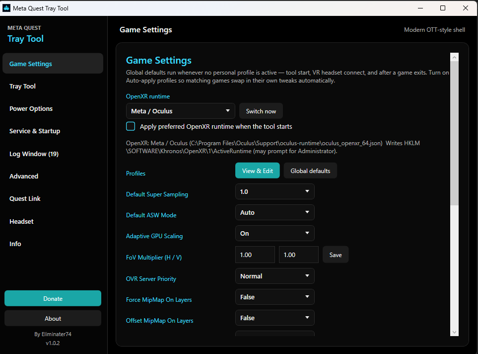
</p>

<details>
<summary>More screenshots (shell pages)</summary>

| Page | Preview |
| --- | --- |
| Game Settings |  |
| Game Settings (custom CLI / ADB) | 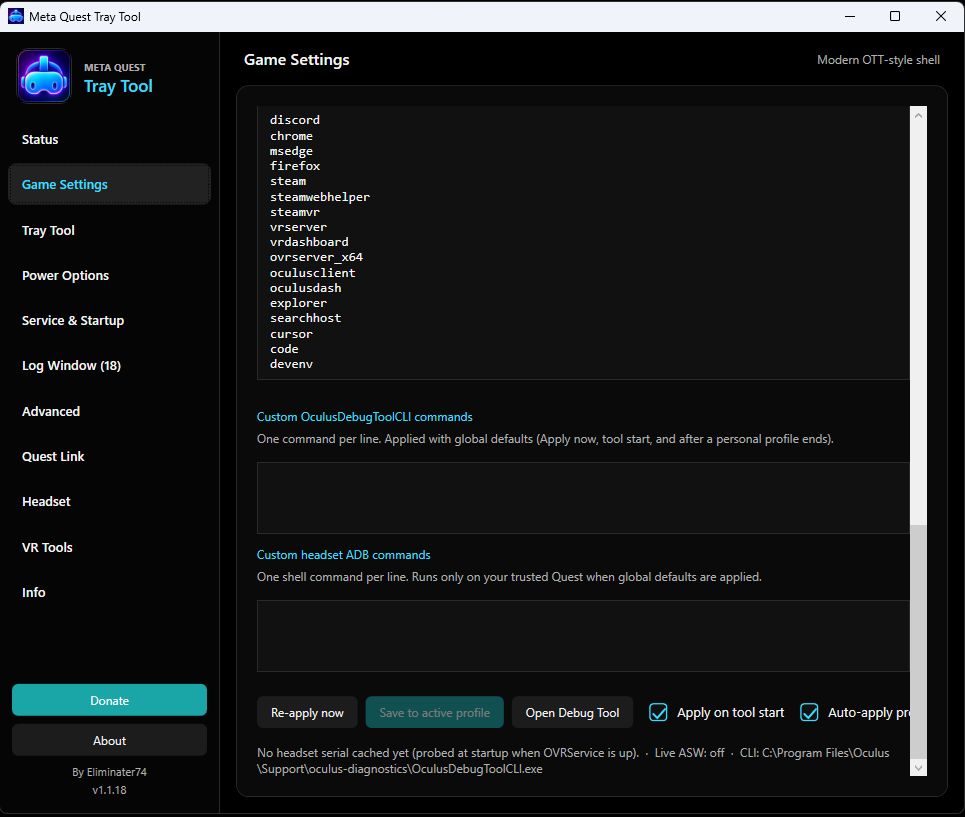 |
| Tray Tool | 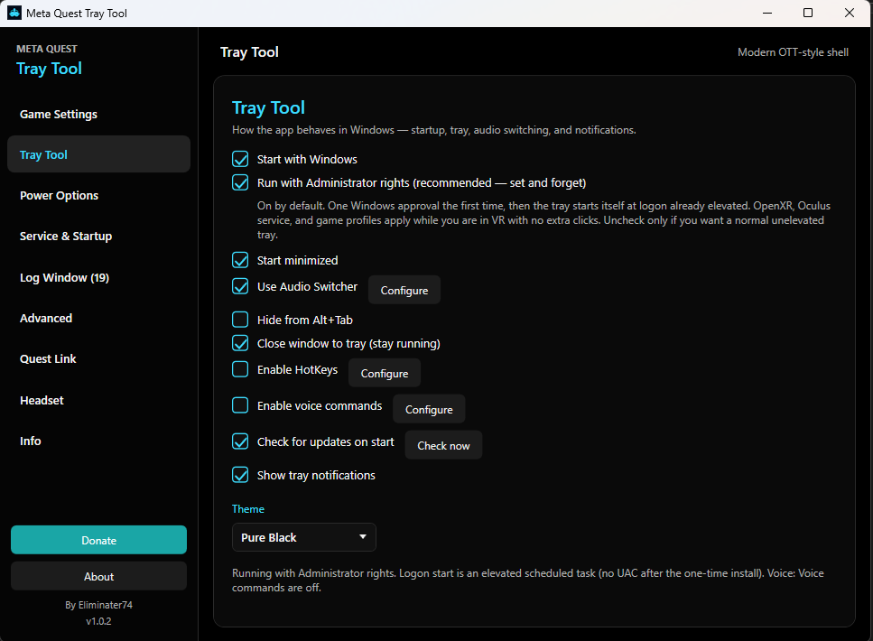 |
| Power Options | 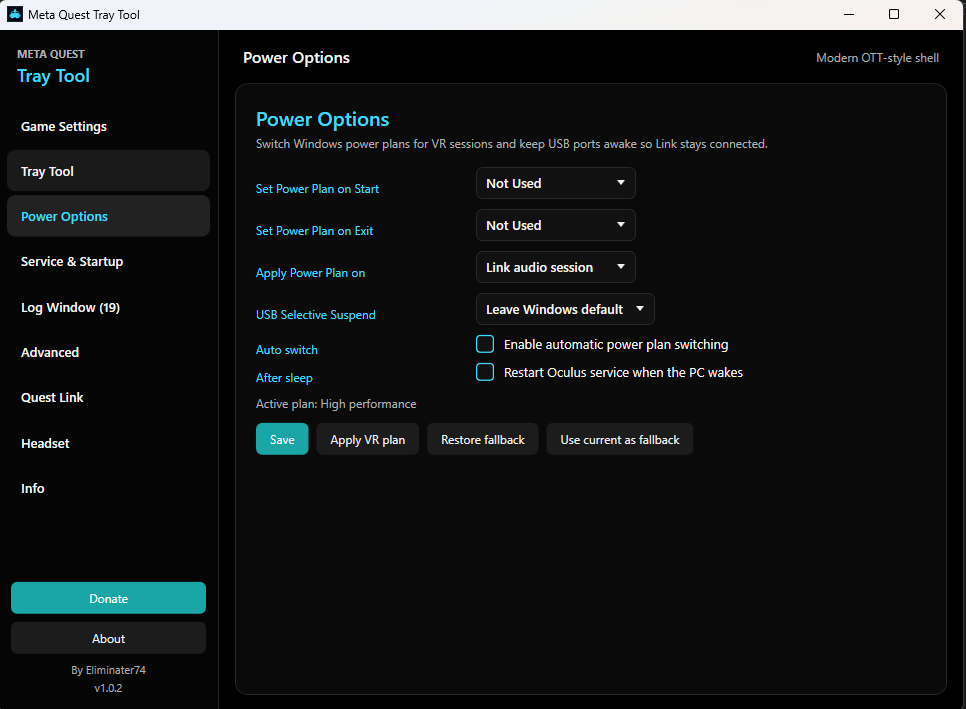 |
| Service & Startup | 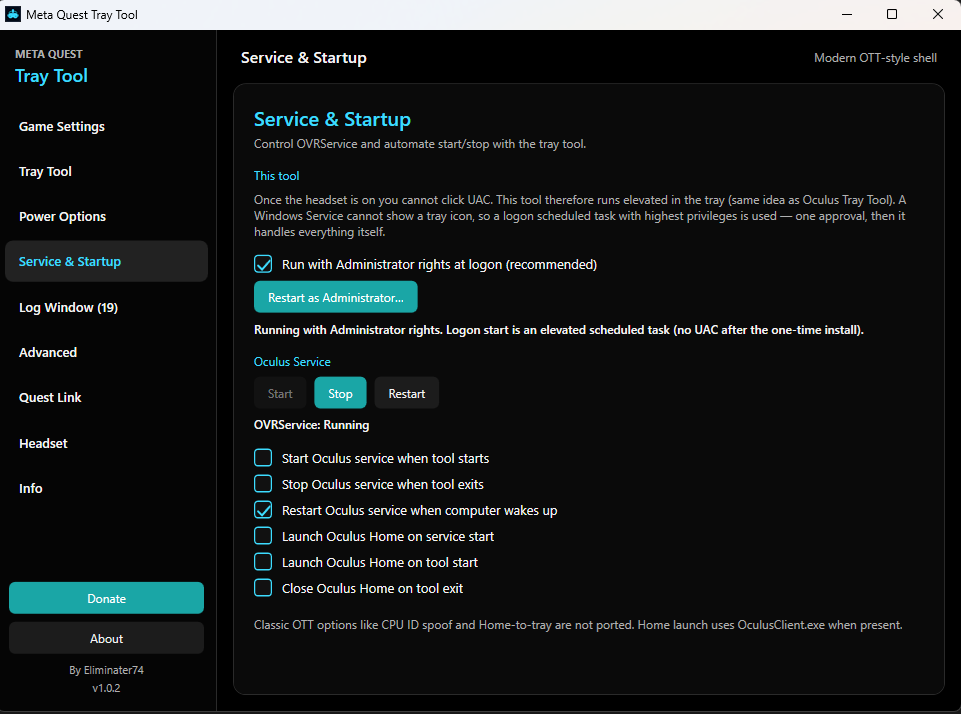 |
| Log Window | 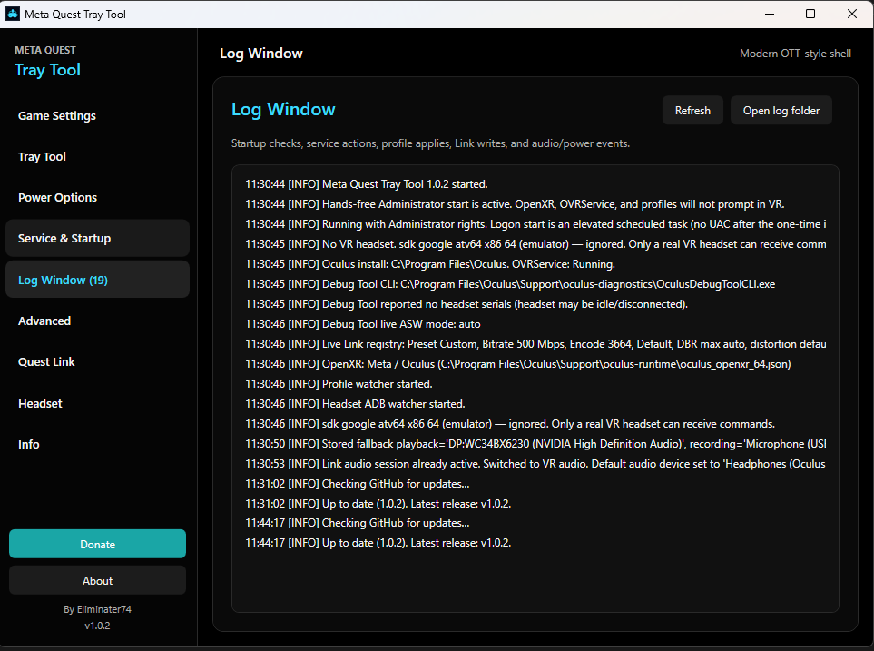 |
| Advanced | 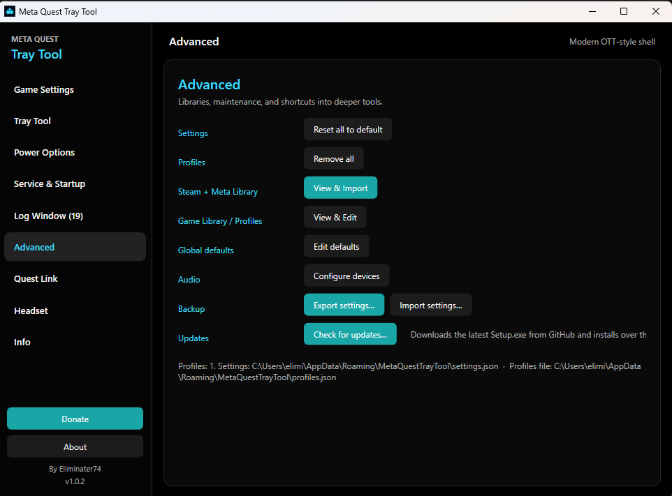 |
| Quest Link | 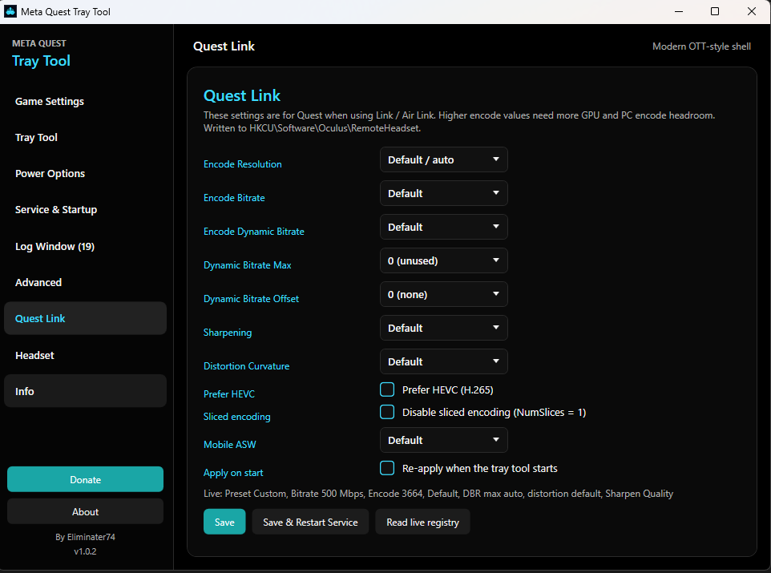 |
| Headset (capture / trust) | 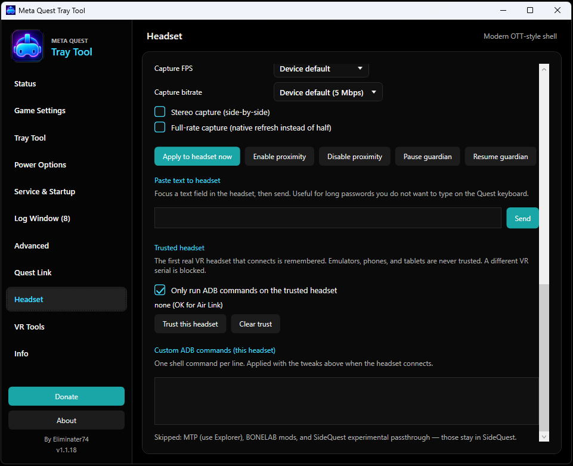 |
| Headset (performance) | 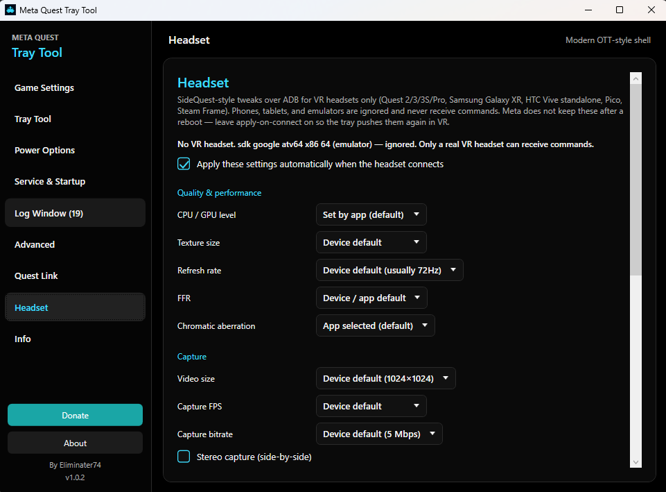 |
| Info | 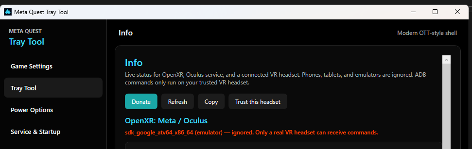 |
| About | 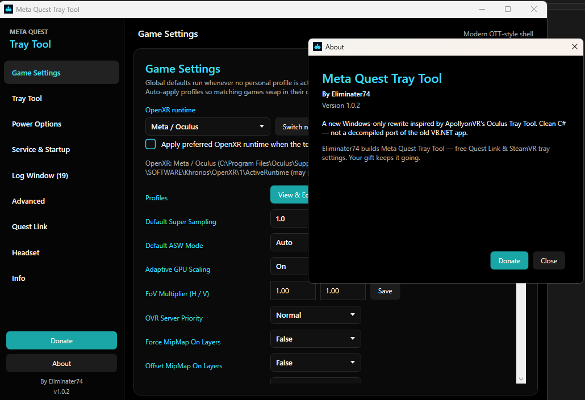 |

</details>

---

## Download

**[Download latest Setup.exe](https://github.com/Eliminater74/MetaQuestTrayTool/releases/latest)** — open the newest release and click the `.exe` asset.

Direct asset links (same files GitHub counts for the Downloads badge):

| Release | Installer |
| --- | --- |
| [v1.0.10](https://github.com/Eliminater74/MetaQuestTrayTool/releases/tag/v1.0.10) (latest) | [MetaQuestTrayTool-Setup-1.0.10.exe](https://github.com/Eliminater74/MetaQuestTrayTool/releases/download/v1.0.10/MetaQuestTrayTool-Setup-1.0.10.exe) |
| [v1.0.9](https://github.com/Eliminater74/MetaQuestTrayTool/releases/tag/v1.0.9) | [MetaQuestTrayTool-Setup-1.0.9.exe](https://github.com/Eliminater74/MetaQuestTrayTool/releases/download/v1.0.9/MetaQuestTrayTool-Setup-1.0.9.exe) |
| [v1.0.8](https://github.com/Eliminater74/MetaQuestTrayTool/releases/tag/v1.0.8) | [MetaQuestTrayTool-Setup-1.0.8.exe](https://github.com/Eliminater74/MetaQuestTrayTool/releases/download/v1.0.8/MetaQuestTrayTool-Setup-1.0.8.exe) |
| [v1.0.7](https://github.com/Eliminater74/MetaQuestTrayTool/releases/tag/v1.0.7) | [MetaQuestTrayTool-Setup-1.0.7.exe](https://github.com/Eliminater74/MetaQuestTrayTool/releases/download/v1.0.7/MetaQuestTrayTool-Setup-1.0.7.exe) |
| [v1.0.6](https://github.com/Eliminater74/MetaQuestTrayTool/releases/tag/v1.0.6) | [MetaQuestTrayTool-Setup-1.0.6.exe](https://github.com/Eliminater74/MetaQuestTrayTool/releases/download/v1.0.6/MetaQuestTrayTool-Setup-1.0.6.exe) |
| [v1.0.5](https://github.com/Eliminater74/MetaQuestTrayTool/releases/tag/v1.0.5) | [MetaQuestTrayTool-Setup-1.0.5.exe](https://github.com/Eliminater74/MetaQuestTrayTool/releases/download/v1.0.5/MetaQuestTrayTool-Setup-1.0.5.exe) |
| [v1.0.4](https://github.com/Eliminater74/MetaQuestTrayTool/releases/tag/v1.0.4) | [MetaQuestTrayTool-Setup-1.0.4.exe](https://github.com/Eliminater74/MetaQuestTrayTool/releases/download/v1.0.4/MetaQuestTrayTool-Setup-1.0.4.exe) |
| [v1.0.3](https://github.com/Eliminater74/MetaQuestTrayTool/releases/tag/v1.0.3) | [MetaQuestTrayTool-Setup-1.0.3.exe](https://github.com/Eliminater74/MetaQuestTrayTool/releases/download/v1.0.3/MetaQuestTrayTool-Setup-1.0.3.exe) |
| [v1.0.2](https://github.com/Eliminater74/MetaQuestTrayTool/releases/tag/v1.0.2) | [MetaQuestTrayTool-Setup-1.0.2.exe](https://github.com/Eliminater74/MetaQuestTrayTool/releases/download/v1.0.2/MetaQuestTrayTool-Setup-1.0.2.exe) |
| [v1.0.1](https://github.com/Eliminater74/MetaQuestTrayTool/releases/tag/v1.0.1) | [MetaQuestTrayTool-Setup-1.0.1.exe](https://github.com/Eliminater74/MetaQuestTrayTool/releases/download/v1.0.1/MetaQuestTrayTool-Setup-1.0.1.exe) |
| [v1.0.0](https://github.com/Eliminater74/MetaQuestTrayTool/releases/tag/v1.0.0) | [MetaQuestTrayTool-Setup-1.0.0.exe](https://github.com/Eliminater74/MetaQuestTrayTool/releases/download/v1.0.0/MetaQuestTrayTool-Setup-1.0.0.exe) |

The installer is **self-contained** (includes .NET 8 — no separate runtime install). Settings are stored in `%AppData%\MetaQuestTrayTool\` and are kept if you uninstall.

The **Downloads** badge uses GitHub’s public asset `download_count`. It only counts clicks on the release **`.exe` asset** (not “Source code” zips). Downloads by the repo owner often stay at **0**; other users’ downloads usually show up after a short delay (shields.io also caches).

---

## How to use

### 1. Install and first launch

1. Download and run `MetaQuestTrayTool-Setup-*.exe` from [Releases](https://github.com/Eliminater74/MetaQuestTrayTool/releases/latest).
2. Launch **Meta Quest Tray Tool** from the Start Menu (or let it start with Windows if you enabled that during setup).
3. The app lives in the **notification area** (system tray). If you do not see the headset icon, click the **^** overflow chevron near the clock.
4. On first run, approve **Administrator mode** when prompted if you want OpenXR switching, OVRService control, and profile apply to work in-headset without UAC. You can also use **Restart as Administrator** from the tray menu later.

### 2. Open settings

- **Left-click** the tray headset icon, or
- **Right-click** the icon → **Open Settings**

The sidebar shell has pages for **Game Settings**, **Tray Tool**, **Power**, **Service & Startup**, **Log**, **Advanced**, **Quest Link**, **Headset (ADB)**, **Profiles**, and **Info**.

### 3. Set your global defaults

1. Open **Profiles** (or **Advanced → Global defaults**) and configure your everyday Link / OpenXR / audio / power preferences.
2. On **Quest Link**, set bitrate, encode width, sharpening, HEVC, and related Link options.
3. On **Game Settings** (tray menu or shell), adjust super sampling, ASW, FOV, and other PCVR tweaks.
4. Changes save automatically to `%AppData%\MetaQuestTrayTool\`.

Global defaults stay applied until a game with a personal profile launches.

### 4. Per-game profiles (optional)

1. Open **Profiles** → **New profile** (or pick a built-in preset such as MSFS 2024 or Beat Saber).
2. Set the **executable name** (e.g. `FlightSimulator.exe`) and any overrides (Link, OpenXR runtime, game settings).
3. When that game starts, the profile auto-applies and you get a tray notification.
4. When the game exits, **global defaults are restored** automatically.

Export/import profiles and full settings from **Advanced**.

### 5. Quest Link / headset tweaks

- **Quest Link** registry settings usually need a Link reconnect or **OVRService** restart — use **Service & Startup** or the tray menu.
- **Headset (ADB)** tweaks (CPU/GPU, refresh rate, texture size, etc.) apply when a trusted Quest connects. Enable **Developer Mode** on the headset and approve USB debugging once. These settings do not survive a headset reboot; the tray re-applies them on connect.
- Only **real VR headsets** are trusted. Phones, tablets, and Android emulators are ignored.

### 6. Tray menu quick actions

**Right-click** the tray icon for:

- Game Settings (SS, ASW, FOV, …)
- Start / stop / restart **OVRService**
- Apply or edit **profiles**
- **Open Settings**, **Info**, **Donate**, **Exit**

### 7. HotKeys and voice (optional)

On **Tray Tool**:

- **HotKeys** — Enable → Configure. Global shortcuts (default **Ctrl+Numpad 1–8**) for ASW, super sampling, apply global, restart OVRService, Performance HUD. Works while the tray app is running, including in VR.
- **Voice commands (preview)** — Enable → Configure. Default **push-to-talk Ctrl+Shift+V**, then say e.g. “A S W off” or “apply global”. Uses Windows speech recognition.

Full shortcut and phrase list: [docs/VOICE-AND-HOTKEYS.md](docs/VOICE-AND-HOTKEYS.md).

### 8. Tips

- **Themes:** Pure Black (default), Dark, or Light — change on the **Tray Tool** page.
- **Updates:** Tray Tool → Check for updates on start (on by default), **Also check while running** (default weekly: daily / 3 days / week / 2 weeks / month / off), or **Check now** / tray menu **Check for updates…**. Confirms, downloads the latest Setup.exe from GitHub, exits the app, then installs over the current location.
- **Start minimized** and **minimize-on-close** keep the app in the tray instead of the taskbar.
- **Service & Startup** highlights **Start** or **Stop** based on whether `OVRService` is running.
- Newer Meta runtimes may reject some `server:` ASW commands; check **Log** if something does not apply.
- Pixel density changes often need a **new VR session** to take effect.

---

## Requirements

- Windows 10 / 11 (64-bit)
- [Meta Quest PC app](https://www.meta.com/quest/setup-link/) and/or [SteamVR](https://store.steampowered.com/app/250820/SteamVR/) for the features you use
- For **Headset (ADB)**: Quest **Developer Mode** + USB debugging approval, **or** Wireless ADB (same Wi‑Fi; Enable tcpip once or use Developer → Wireless debugging). ADB is bundled — no Android Studio required

---

## What works now

Release **[v1.0.10](https://github.com/Eliminater74/MetaQuestTrayTool/releases/latest)** adds **Wireless ADB** (host/port, tcpip helper, auto-reconnect) and further idle-CPU cuts (audio/USB caches, slower background polls, watchers off the UI thread). Builds on v1.0.9 snappy navigation.

- Runs in the notification area with a right-click popup menu
- Opens a modern **OTT-style sidebar shell** (Game Settings, Tray Tool, Power, Service & Startup, Log, Advanced, Quest Link)
- Detects the Oculus PC install and `OVRService` status
- Start / stop / restart the Oculus runtime service, with optional start/stop automation
- Saves settings to `%AppData%\MetaQuestTrayTool\settings.json`
- **Hands-free Administrator mode** (on by default): one Windows approval, then the tray starts itself at logon already elevated so OpenXR, OVRService, and profiles apply while you are in VR — no UAC in-headset
- Optional **Restart as Administrator** if that first approval was skipped
- Start minimized, minimize-on-close, hide from Alt+Tab
- **Themes:** Pure Black (default), Dark, and Light — change anytime on the Tray Tool page
- Tray **Game Settings**: Super Sampling, ASW (including 45/30/18), FOV, Adaptive GPU, mip layer flags, FOV stencil, and Visual HUD via `OculusDebugToolCLI.exe`
- **Open Oculus Debug Tool GUI** (`OculusDebugTool.exe`) from Service & Startup, Game Settings, Advanced, tray, hotkey/voice — same shortcut classic OTT offered
- Startup probe of connected headset serials through `server:EnumHmd`
- Create / edit / delete / apply **profiles** from the tray or shell
- Personal profiles can override **Link sharpening / bitrate / encode width** (inherit keeps global Quest Link settings; restored when the game exits)
- **OpenXR runtime switch**: Meta / Oculus vs SteamVR via `HKLM\SOFTWARE\Khronos\OpenXR\1\ActiveRuntime` — global preferred + per-game profile override (may prompt for Administrator)
- **Dash → SteamVR**: after Meta Air Link / Link connects, kill Oculus Dash and launch SteamVR (button / tray / Ctrl+Num 0 / voice “kill dash”) so SteamVR games run over Link — inspired by [OculusKiller](https://github.com/DevOculus-Meta-Quest/OculusKiller); optional auto-on-connect, **PreventDashLaunch**, and **CoreChannel** (`LIVE` / `PublicTest` / `NO_UPDATES`) on Service & Startup
- Auto-apply a profile when the matching process starts, then restore defaults when it exits
- **Quest Link / Air Link**: bitrate, encode width, HEVC, sliced encoding, sharpening, distortion curve, dynamic bitrate (DBR / DBR max / offset), Mobile ASW mode via `HKCU\Software\Oculus\RemoteHeadset` — see [docs/ODT-REGISTRY.md](docs/ODT-REGISTRY.md)
- **Quest Link presets**: Balanced / Performance / Quality / Air Link HEVC / Wired H.264 / Sim on the Quest Link page (fill fields or apply & save)
- **Audio switching**: auto-switch when Link audio is active, restore desktop devices when Link drops
- **Power plan**: auto-switch plans, USB selective-suspend off, restart service after sleep
- **Steam / Meta library picker** with cover art (Steam librarycache / CDN, Meta StoreAssets), plus separate **global defaults**
- **Headset (ADB)**: SideQuest-style CPU/GPU, texture size, refresh rate, FFR, chroma, and capture props — auto-applied when the Quest connects (they do not survive reboot)
- **Wireless ADB**: save LAN IP/port, Connect / Disconnect, Enable tcpip over USB once, optional auto-reconnect when no headset is listed
- **Trusted headset**: first connected **VR headset** serial is remembered; a different VR serial is blocked. Phones, tablets, and Android emulators are ignored and never receive ADB commands or auto-apply
- **Profiles**: auto-apply on game launch with tray notification; restore global when the game exits. Stored in `profiles.json` (export/import still works). Built-in global + game presets (MSFS 2024, Beat Saber, etc.)
- **Backup**: export / import settings from Advanced
- **Info** page: live OpenXR (Meta vs SteamVR), OVRService, PCVR connection (Meta Air Link vs wired via DeviceCache `isUsingAirLink`, Steam Link / SteamVR, Virtual Desktop), and detailed headset identity
- **Virtual Desktop / Steam Link awareness**: when those sessions are active, Meta Link registry + Oculus Debug Tool (SS/ASW) are auto-skipped and UI controls disabled; headset ADB, OpenXR, power, and audio still apply
- **Steam Link assist**: warns (and optionally auto-switches) if OpenXR is not SteamVR during a Steam Link / SteamVR session, then restores your preferred OpenXR runtime when Steam Link ends; bitrate/resolution stay in Steam Link + SteamVR Video settings
- **Donate** button (sidebar, About, tray) opens the [PayPal donate page](https://www.paypal.com/donate/?business=X76ZW4RHA6T9C&no_recurring=0&item_name=Eliminater74+builds+Meta+Quest+Tray+Tool+%E2%80%94+free+Quest+Link+%26+SteamVR+tray+settings.+Your+gift+keeps+it+going.&currency_code=USD)
- **HotKeys**: global shortcuts + configure UI (default **Ctrl+Numpad 1–8**)
- **Voice commands (preview)**: Windows speech recognition, push-to-talk (**Ctrl+Shift+V** default), routes through the same actions as hotkeys
- **Service & Startup**: Start/Stop button accent follows live `OVRService` state
- **In-app updates**: checks GitHub latest release (`v*`) on start, on a user-chosen schedule while running, or manually; downloads Setup.exe, closes the app, installs over the existing copy (Tray Tool / Advanced / tray menu). ADB is stopped before Setup so bundled platform-tools can be replaced
- **Hover tooltips** on pages and settings windows (what each control does, without cluttering the layout)
- **Low idle CPU / snappy sidebar**: caches for Link probe, audio devices, USB, ADB, and OVRService; slower background polls; Link/Steam/Headset/profile watchers run off the UI thread; page content paints before heavy Refresh

Not yet: Oculus Homeless, Permanent AirLink, custom voice phrases / mic picker.

See [ROADMAP.md](ROADMAP.md) and [docs/VOICE-AND-HOTKEYS.md](docs/VOICE-AND-HOTKEYS.md) for details.

---

## Project docs

| File | Use when you need to… |
| --- | --- |
| [docs/README.md](docs/README.md) | Index of all documentation |
| [docs/ODT-REGISTRY.md](docs/ODT-REGISTRY.md) | ODT registry keys vs CLI commands (from Meta binaries) |
| [docs/VOICE-AND-HOTKEYS.md](docs/VOICE-AND-HOTKEYS.md) | Hotkey shortcuts and voice phrase reference |
| [docs/media/README.md](docs/media/README.md) | Screenshots and demo video |
| [ROADMAP.md](ROADMAP.md) | See the planned phases and why they exist |
| [TODO.md](TODO.md) | Check what is done vs next, checkbox style |
| [REDDIT.md](REDDIT.md) | Copy-paste Reddit announcement (title + body) |
| [installer/README.md](installer/README.md) | Build the Windows Setup.exe locally |

---

## Build from source (developers)

**Requirements:** [Visual Studio Community](https://visualstudio.microsoft.com/vs/community/) with the **.NET desktop development** workload, or .NET 8 SDK.

**Visual Studio:** open `MetaQuestTrayTool.sln`, choose `Debug` or `Release`, press F5.

**Command line:**

```powershell
dotnet build .\MetaQuestTrayTool.sln -c Release
dotnet run --project .\src\MetaQuestTrayTool\MetaQuestTrayTool.csproj
```

Starting or stopping `OVRService` during development may require running as Administrator.

### Build Setup.exe locally

```powershell
winget install --id JRSoftware.InnoSetup -e   # once
.\scripts\build-installer.ps1
```

Output: `dist\MetaQuestTrayTool-Setup-<version>.exe`. Details: [installer/README.md](installer/README.md).

### GitHub Actions

- Every push to `main` runs **CI** (build + publish smoke test).
- Pushing a tag `v*` (or **Actions → Release → Run workflow**) builds Setup.exe and publishes a [GitHub Release](https://github.com/Eliminater74/MetaQuestTrayTool/releases):

```powershell
git tag v1.0.1
git push origin v1.0.1
```

---

## Inspired by

- [Oculus Tray Tool](https://www.guru3d.com/download/oculus-traytool-download/) by ApollyonVR
- [Oculus_Tray_Manager](https://github.com/DevOculus-Meta-Quest/Oculus_Tray_Manager) (earlier C# conversion of OTT)
- [MetaQuestTrayManager](https://github.com/DevOculus-Meta-Quest/MetaQuestTrayManager) (earlier WPF rewrite)
- [Oculus VR Dash Manager](https://github.com/DevOculus-Meta-Quest/Oculus-VR-Dash-Manager)

This repo is a clean start. The old conversion work stays in those repositories.
